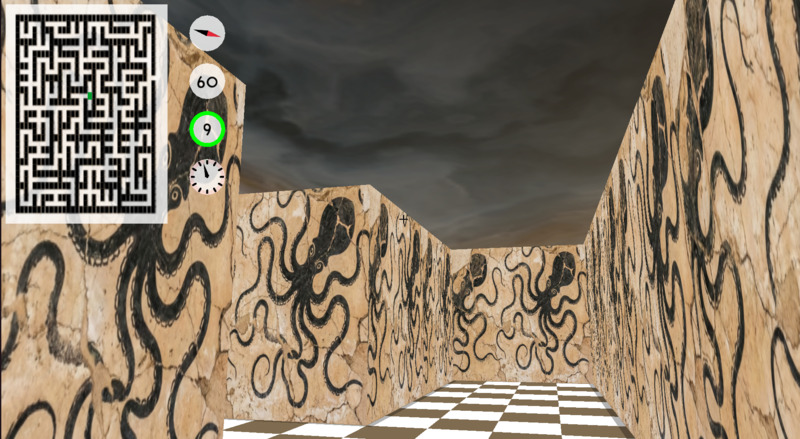

# By a Thread

- [Overview](#overview)
- [Spec](#spec)
- [How to play](#how-to-play)
  - [Objective](#objective)
  - [Controls](#controls)
- [Where to play](#where-to-play)
  - [Locally](#locally)
  - [Online plan](#online-plan)
- [Link](#links)
  - [Maze-generating algorithms](#maze-generating-algorithms)
  - [Netcode](#netcode)

## Overview

This is my response to the 01Edu/01Founders challenge [multiplayer-fps](https://github.com/01-edu/public/tree/master/subjects/multiplayer-fps) (commit bb1e883). The aim is to remake [Maze](<https://en.wikipedia.org/wiki/Maze_(1973_video_game)>), a multiplayer first-person shooter from 1973.

I used Macroquad, a simple game framework, for window management, reading input, loading textures, rendering, and audio. I used the Renet library for some networking abstractions over UDP.

On the other hand, I wrote my own collision and movement physics (drawing on what I learnt in an [earlier project on ray tracing](https://github.com/pjtunstall/a-ray-tracer-darkly)), generated my own mazes, and went to town with the networking. For more details on what that entails and how I did it, see the [Netcode](docs/netcode.md) document.

For more on the structure of my project, see [Architecture](docs/architecture.md).

## Status

Successfully tested on VPS; currently working on a matchmaking service to support concurrent sessions.

## Spec

According to the 01 spec, the game is expected to include:

- all elements of the original game:
  - multiplayer,
  - 3D, 1st person perspective,
  - shooting,
  - set in a maze;
- client-server architecture;
- communication via the UDP networking protocol;
- frames-per-second meter to monitor in-game performance;
- three levels with mazes of increasing difficulty, defined as more dead ends.

## How to play

### Objective

- Single player: Escape in time
- Multiplayer: Be the last one standing

### Controls

- WASD to move
- Arrow keys to turn
- Space to fire
- Left shift for sniper mode

- Escape to quit/exit

## Where to play

The game is not yet publicly online. Proper matches will have to wait till then. For now, you can get a taste of it by running server and client locally (on one machine).

### Locally

Clone this repo, `cd` into it. Install [Rust](https://rust-lang.org/tools/install/) and run `cargo run --release -p server` in one terminal. For each player, open another terminal and run `cargo run --release -p client`. Then follow the prompts.

As a shortcut, you can press Tab to connect to localhost. When connecting to a remote server, the client gets IP and PORT as environment variables from a `.env` file.

The passcode will appear in the server terminal.

### Online plan

Looking ahead to distribution of the client binary, see the [Build](docs/build.md) guide.

My plan is to play test it first on a VPS, then make it public according to the scheme outlined in [Security](docs/security.md). See [Docker](#docs/docker.md) for an idea of how the server is being deployed for initial testing.

## Links

### Maze-generating algorithms

- Jamis Buck: [The Buckblog](https://weblog.jamisbuck.org/archives.html).
- Jamis Buck: [Mazes for Programmers](http://www.mazesforprogrammers.com/).

### Netcode

- Gabriel Giambetta: [Fast-Paced Multiplayer](https://gabrielgambetta.com/client-server-game-architecture.html).
