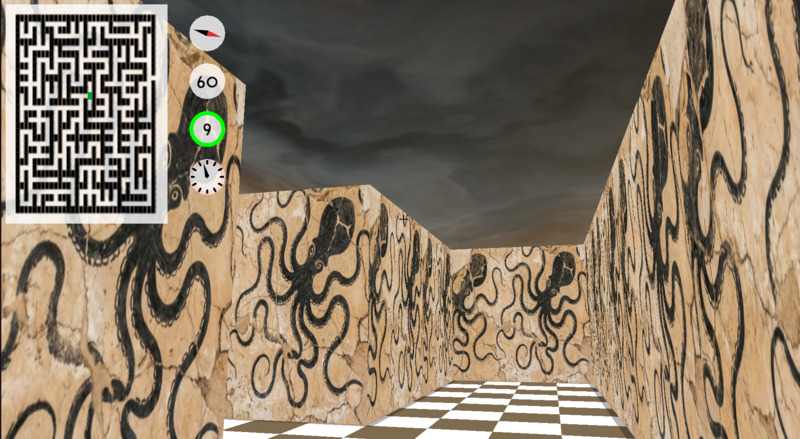

# By a Thread

- [Overview](#overview)
- [Status](#status)
- [Spec](#spec)
- [Extras](#extras)
- [How to play](#how-to-play)
  - [Objective](#objective)
  - [Controls](#controls)

## Overview

This is my response to the 01Edu/01Founders challenge [multiplayer-fps](https://github.com/01-edu/public/tree/master/subjects/multiplayer-fps) (commit bb1e883). The aim is to remake [Maze](<https://en.wikipedia.org/wiki/Maze_(1973_video_game)>), a multiplayer first-person shooter from 1973.

I wrote my own collision and movement physics (drawing on what I learnt in an [earlier project on ray tracing](https://github.com/pjtunstall/a-ray-tracer-darkly)) and went to town with the networking.

I delegated window management, reading input, loading textures, rendering, and audio to Macroquad, a simple game framework. I used the Renet library for some networking abstractions over UDP.

## Spec

According to the 01 spec, the game should include:

- all elements of the original game:
  - multiplayer,
  - 3D, 1st person perspective,
  - shooting,
  - set in a maze;
- client-server architecture;
- communication via the UDP networking protocol;
- frames-per-second meter to monitor in-game performance;
- three levels with mazes of increasing difficulty, defined as more dead ends;
- option to connect to an arbitrary server.

## Extras

I went beyond the spec in a few ways.

**DevOps:**

- Cloud-hosted backend
- Matchmaker API that spawns game servers in response to client requests, allowing concurrent sessions
- Containerization with Docker Compose
- Automatic updates from Docker Hub via Watchtower
- Makefile and associated scripts for build and deployment
- GitHub Actions:
  - to build client (Windows, Linux, macOS) and deploy backend to Docker Hub
  - to deploy backend to VPS on a scheduled basis, or manually if needed

**Security:**

- Request validation and authentication: client proof (baked-in secret), version checks, and constant-time comparison to mitigate timing attacks
- Least-privilege access: Docker socket proxy so the matchmaker can only perform allowed container operations, limiting impact if compromised
- Secure session lifecycle: connect tokens with appropriate expiry, rate limiting, and cleanup of orphaned game-server containers on startup
- TLS termination and certificate management via Caddy reverse proxy

**Netcode:**

- Clock synchronization
- Reconciliation and prediction for local player
- Interpolation for remote players
- Extrapolation for bullets

For more information on specific topics, see the following documents:

- [Architecture](docs/architecture.md)
- [Netcode](docs/netcode.md)
- [Mazes](docs/mazes.md)
- [Security](docs/security.md)
- [Build](docs/build.md)
- [DevOps](docs/devops.md)
- [How to run the backend locally](docs/local-backend.md)

## How to play

### Objective

- Single player: Escape in time
- Multiplayer: Be the last one standing

### Controls

In-game:

- WASD to move
- Arrow keys to turn
- SPACE to fire
- LEFT SHIFT for sniper mode

In-game or in the lobby:

- ESCAPE to quit/exit

## Status

Currently in private beta. Successfully tested on Hetzner VPS with the Linux AppImage, Linux deb, and Windows versions of the client.

Next steps:

- Test macOS (Intel and Apple Silicon)
- Test Linux rpm
- Troubleshoot one user's report of a graphics driver issue on Windows
- Continue incremental refactoring
- Review remaining TODO in comments
- Handle feedback
- Publish on itch.io

Till then, please contact me if you'd like to play, and I'll send you a private link.

Possible further developments:

- Observability with Prometheus, Loki, and Grafana
- Load testing
- Tests for matchmaker package
- Unit tests for client::matchmaker module
- AI opponents
